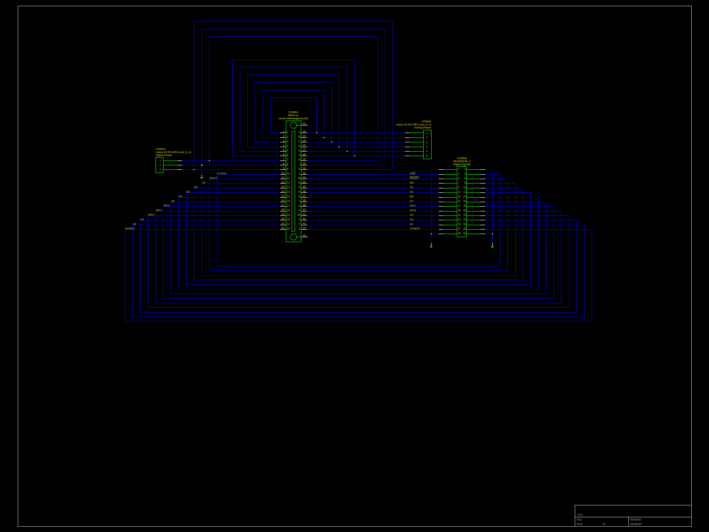
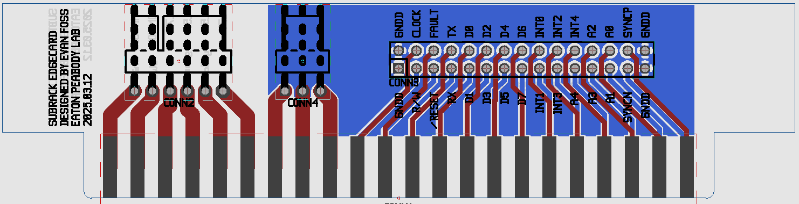
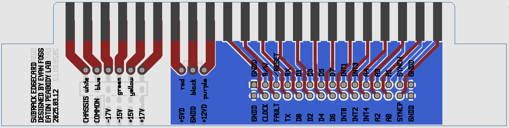

# EPL Subrack Module

Designed by Evan Foss
Primarily done in 2014
Documented 2025.03.12

## Purpose

This project is a template and parts meant to make designing projects for the <a href="https://github.com/EPL-Engineering/epl_subrack">EPL Subrack</a> easier. It's basically just a premade standardized PCB edge card used at the moment for power and a front panel template for use with the modules that fit that subrack.

|Quantity           |Part Number                            |Vendor                     |Description                        |Application
|:---------------   |:---------------                       |:---------------           |:---------------                   |:---------------
|1                  |EFP164A97F                             |Vector Electronics         |Subrack Module Chassis             |Subrack Module Chassis
|4                  |N.A.                                   |Generic                    |Binding Head Philips Drive Screws  |Used on the front panel
|4                  |N.A.                                   |Generic                    |Internal Toothed Lock Washers      |Used on the front panel
|4                  |N.A.                                   |Generic                    |Cheese Head Screws                 |Use on the rear panel
|1                  |N.A.                                   |Custom Manufactured        |Front Panel                        |Front Panel
|1                  |N.A.                                   |Custom Manufactured        |Edge Card PCB                      |Rear Interconnect with subrack

As the intention is to keep the modules in use for many years as projects are built and retired recycling the housing's changing the screws from the stock ones is important.

## Design

The circuit design is very simple because this is just an adapter.

| 
|:---------------
| Schematic

Note there is another schematic labeled "hidden-magic" but it's empty. It is just part of my standard template for drafting PCB.

| 
|:---------------
| 
| PCB Layout

| 
|:---------------
| 
| Mechanical Alignment of the rear PCB. The left (power connection end) is the side that goes up.

The alignment of the rear PCB is critical for a few reasons.
 1. We don't want the PCB centered as that could lead to someone inserting a module upside down and burning it up.
 2. We don't want the PCB to come loose and slide into the backplane connector on an angle and short out or partially connect.
 3. We depend on the alignment of 4 or 5 modules in the rack during it's assembly to align the backplane.
 4. I hate the sound of things rattling in a completed device.

| 
| :---------------
| Front Panel template.

The front panel template has a few important features that the standard included front panel does not.
 1. The screw outlines are machined down to remove the anodizing from under the lockwashers so they make proper electrical contact for grounding.
 2. I rounded the corners so that when you insert or extract a module they don't risk cutting your hands.

Observe the front panel has a bottom hole which the current subracks do not use but the original ones did.

## Future

This is a mature design. All that really needs to happen is for the digital connections in the module to see some more use. Those pin allocations may evolve over time but they should *never* be made module specific.

